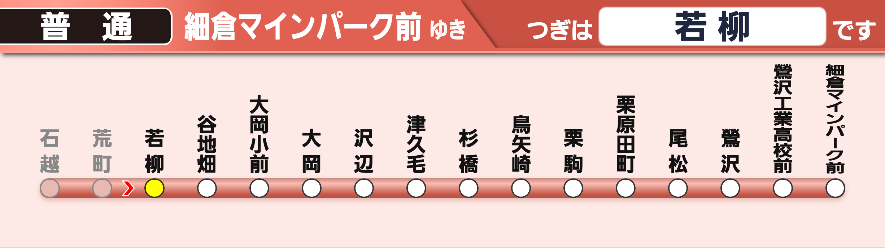

# hk-lcd

阪急電車の発車標を再現した Web アプリです。  
PWA 対応で、スマートフォンやタブレットでもアプリのように利用できます。  
Vercel にデプロイして公開することを前提に作成されています。

 <!-- スクショがある場合は差し替えてください -->
 <!-- スクショがある場合は差し替えてください -->

---

## 概要

- 阪急電車の発車標を模した表示デザイン
- **PWA 対応**：ホーム画面に追加してフルスクリーン表示可能
- **Vercel デプロイ対応**：簡単にホスティング・公開が可能
- **esbuild ビルド**：軽量・高速なビルド環境
- **Fontplus Web フォント使用**：公式書体に近い雰囲気を再現

---

## 動作環境

- Node.js 18 以降
- npm または yarn

---

## セットアップ

```bash
# リポジトリを取得
git clone https://github.com/yourname/hk-lcd.git
cd hk-lcd

# 依存関係をインストール
npm install

# ビルド&サーバー起動
npm start

# ビルドのみ
npm run build

# サーバー起動のみ
npm run dev
```
